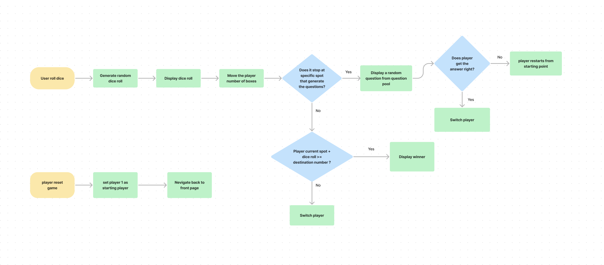

# Project : Random Dice game

### Data: 7/3/2022

### By: Carolyn Chien

[Github](https://github.com/Carolynchien) |
[Linkedin](https://www.linkedin.com/in/yin-ting-chien-6a14b8161/)

---

## _*Description*_

This is a game that each player can roll the dice, the represented dot(icon) on the board will move forward according to that number each time the player rolls.
when the player lands on a speific spot, a random question will pop up from the question pool, if the player doesn't answer correctly , they are sent back to the starting point.....

**. ...**

---

## _*Technology Used*_

- HTML
- Javascript
- CSS

---

## _*Flowchart*_

---

## _*Tasks With Trello*_

[My Trello](https://trello.com/b/Km6pcS9v/project1)

---

## _*Credits*_

#### Questions pool: [The Trivia API](https://the-trivia-api.com)

#### Background Video: [Vecteezy](https://www.vecteezy.com/free-videos/cartoon-landscape)
