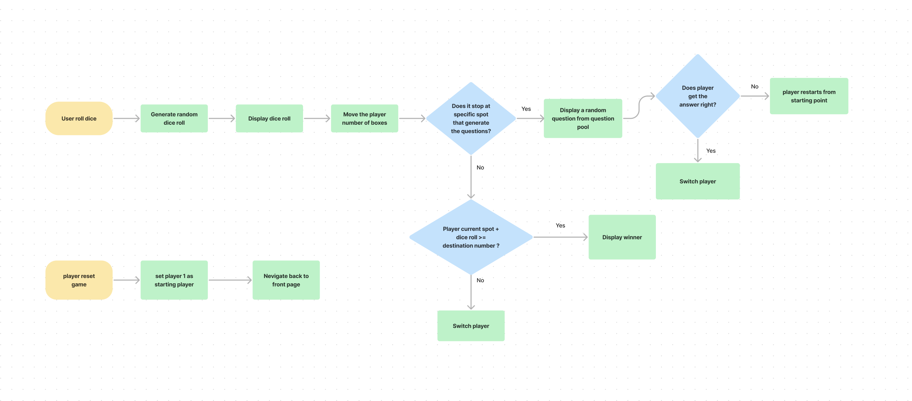

# Project : Random Dice game

### Data: 7/3/2022

### By: Carolyn Chien

[Github](https://github.com/Carolynchien) |
[Linkedin](https://www.linkedin.com/in/yin-ting-chien-6a14b8161/)

---

## _*Description*_

This is a game that player can roll the dice and the represented dot on the box will move forward according to that number each time player get.
when the player land on a speific spot, a random question will pop up from the question pool, if the palyer doesn't get the correct answer, the current player will be suspend once.....

**. ...**

---

## _*Technology Used*_

- HTML
- Javascript
- CSS

---

## _*Wireframe*_

---

## _*Tasks With Trello*_

[My Trello](https://the-trivia-api.com)

---

## _*Credits*_

#### Questions pool: [The Trivia API](https://the-trivia-api.com)
